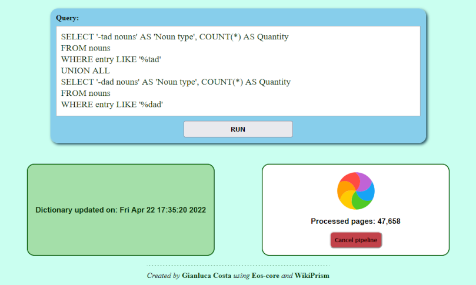

# Jardinero

_Extensible web application for exploring natural languages_


## Introduction

_Natural languages_ are as _sublime_ as exquisite flowers in a garden - and from such a naturalistic simile stems the name of this web application: **Jardinero**, meaning _gardener_.

I definitely needed a tool to perform morphological analysis over the Spanish language - that is, I wanted to find an answer to questions like:

> Why some Spanish words end with -tad, whereas others end with -dad? What are the differences between them, in terms of both morphology and cardinality?

To solve this mystery - and several more - I decided to create Jardinero, a web application extracting my compact SQLite Spanish dictionary from **Wikcionario**, ready for custom SQL queries.

While developing the project, I felt it would be nice to extend the approach to any language, thus creating the whole open source architecture consisting of:

- [Eos-core](https://github.com/giancosta86/Eos-core) - type-checked, dependency-free utility library for modern Python

- [WikiPrism](https://github.com/giancosta86/WikiPrism) - library for parsing wiki pages and creating dictionaries

- [Cervantes](https://github.com/giancosta86/Cervantes) - WikiPrism-based library extracting a compact Spanish dictionary from Wikcionario

- **Jardinero**: hybrid Python/TypeScript web application, with a Flask backend and a React frontend communicating via websockets

As a core aspect, the architecture can be easily _extended_ by creating Python modules and packages named _linguistic modules_.

To explore in detail how the whole system works, as well as its creation process, please consult **my presentation on SpeakerDeck**: [The making of Jardinero](https://speakerdeck.com/giancosta86/the-making-of-jardinero).

## Main features

Jardinero's user interface enables users to:

- **create a SQLite dictionary from a wiki file** - whose URL depends on the current linguistic module

- **perform queries** - in SQL or even in a custom DSL - upon the internal dictionary

- **re-create the dictionary**, especially when the data source gets frequent updates



## Requirements

Jardinero requires at least **Python 3.10** - available at [Python's official website](https://www.python.org/) or via your operating system's package manager.

## Installation

You can install Jardinero just like any other PyPI package for your Python distribution:

```bash
pip install info.gianlucacosta.jardinero
```

## Running Jardinero

1. Jardinero requires a _linguistic module_ - for example, [Cervantes](github.com/giancosta86/Cervantes/), dedicated to the Spanish language:

   ```bash
   pip install info.gianlucacosta.cervantes
   ```

1. Jardinero should preferably be run with Python's **-OO** and **-m** command-line arguments:

   ```bash
   python -OO -m info.gianlucacosta.jardinero <linguistic module>
   ```

   which, in the case of Cervantes, becomes:

   ```bash
   python -OO -m info.gianlucacosta.jardinero info.gianlucacosta.cervantes
   ```

1. Then, you can just point any browser to http://localhost:7000/

## Running in developer mode

By omitting the **-OO** (and even the **-O**) flag, Jardinero will start in _developer mode_ - which enables additional aspects:

- Flask running with **file watching** enabled

- More fine-grained **logging**

- **HTTP redirection** to the Webpack development server

- Python's **\_\_debug\_\_** global variable set to **true** - for example, in this case, Cervantes downloads from localhost and not from Wikcionario's official website

For simplicity, Jardinero's TOML project includes auxiliary scripts:

- Webpack's frontend development server, in watch mode:

  ```bash
  poetry run poe setup-frontend
  ```

  ```bash
  poetry run poe start-frontend
  ```

- Python's static HTTP server, serving files from your **$HOME/Downloads** directory:

  ```bash
  poetry run poe start-static
  ```

The above command lines can be further simplified if you add the following alias to your shell configuration - especially **.profile** for Bash:

```bash
alias poe='poetry run poe'
```

Once the above commands have been issued, you can just start Jardinero in development mode:

```bash
python -m info.gianlucacosta.jardinero <linguistic module>
```

and finally open your browser to the usual address - http://localhost:7000/

## Extending Jardinero

Jardinero is designed to be extensible! I created it to explore the nuances of the Spanish language, but it can support arbitrary combinations of parameters:

- **source wiki URL** - provided it points to a BZ2-compressed file

- **term-extraction algorithm** from each wiki page

- **SQL schema** in the SQLite db

It is definitely up to your needs and creativity! 😊

Your _linguistic module_ can be just a Python module (or a package) - within the current Python module search path - containing these functions:

- **get_wiki_url**: a **() -> str** function returning the URL of a BZ2-compressed XML wiki file, which in turn should have the format described in [WikiPrism](https://github.com/giancosta86/WikiPrism) documentation

- **extract_terms**: a **(Page) -> list\[TTerm\]** function, extracting a list of terms from a given wiki page

- **create_sqlite_dictionary**: a **(Connection) => SqliteDictionary\[TTerm\]** function creating an instance of a WikiPrism **SqliteDictionary** from the given SQLite connection. In particular, _it is the Dictionary that actually responds to queries_, so you might want to design your own DSL via a custom subclass.

The exact meaning of **TTerm** depends on your linguistic model: to explore a real-world example, please refer to [Cervantes](https://github.com/giancosta86/Cervantes) - my library dedicated to the analysis of the Spanish language.

## Final thoughts

Jardinero's core point is the web UI for creating and querying custom dictionaries, as well as its extensible engine.

Of course, there are limitations: if you need advanced features like pagination, charts, and even more analysis tools, you can still run Jardinero to create your custom SQL db, that will be stored at:

> $HOME/.jardinero/\<module name\>/dictionary.db

Then, you can also use your favorite database explorer - such as the excellent, open source [DB Browser for SQLite](https://sqlitebrowser.org/).

## Further references

[The making of Jardinero](https://speakerdeck.com/giancosta86/the-making-of-jardinero) - _Story of a software engineer who wanted to learn Spanish_

[Cervantes](https://github.com/giancosta86/Cervantes) - Extract a compact Spanish dictionary from Wikcionario, with elegance

[WikiPrism](https://github.com/giancosta86/WikiPrism) - Parse wiki pages and create dictionaries, fast, with Python

[Eos-core](https://github.com/giancosta86/Eos-core) - Type-checked, dependency-free utility library for modern Python

## Special thanks

- [Rainbow loader](https://icons8.com/preloaders/en/circular/rainbow/) from [Preloaders.net](https://icons8.com/preloaders/)
