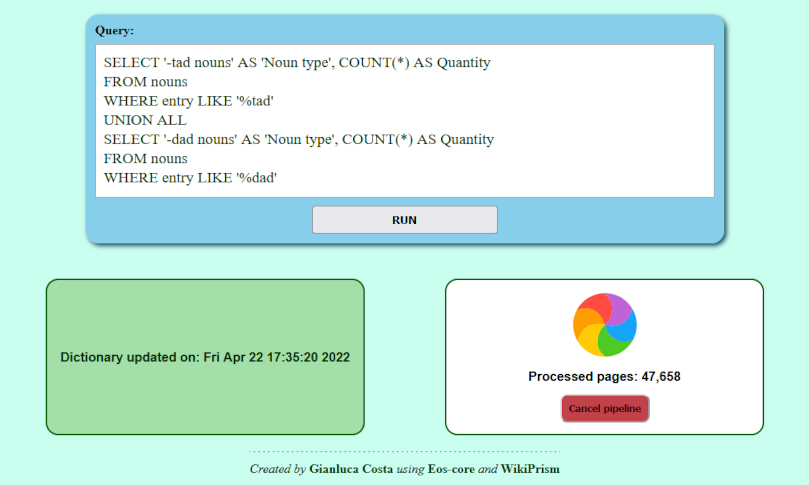

<style>

* {
  color: #083612 !important;
}

section {
  display: flex;
  justify-content: flex-start;
  flex-direction: column;
}


section.title {
  align-items: center;
  justify-content: center;
}

section.title h1 {
  font-size: 3em;
}

section.title h2 {
  font-size: 2em;
}

section.title h3 {
  font-size: 1.5em;
}


blockquote {
  quotes: "«" "»" "«" "»";
  border: none;
  text-align: center;
  margin-bottom: 1em;
}

blockquote p {
  display: inline;
  font-weight: bold;
  font-size: 1.2em;
  line-height: 1.25em;
  vertical-align: middle;
}

blockquote:before {
  content: open-quote;
}

blockquote:after {
  content: close-quote;
}

pre {
  background: #e9faed;
}

/* Page numbers */
section:after {
  font-weight: bold;
}

/* Page numbers for titles */
section.title:after {
  display: none;
}

footer {
  display: none;
}

section.picture p:not(h1) {
  text-align: center;
}

section.picture img {
  height: 500px;
}

a,
  a:active,
  a:visited {
    font-weight: bold;
    text-decoration: underline;
  }

</style>

<!-- _class: title -->

<style scoped>
  img {
    margin-top: -1.1em;
  }

  h4 {
    margin-top: -3em;
  }

  footer {
    display: block;
    font-style: italic;
  }
</style>

<!-- footer: "Latest update: 2022-05-03"  -->

### Gianluca Costa [:butterfly:](https://gianlucacosta.info/)

## The making of


#### Story of a software engineer who wanted to learn Spanish

---

# Foreword

> :thinking:In the end, what's the difference between any passionate
> 💻*software engineer* and an 🖌️*artist*?

I firmly believe that 🎨**creativity** is the very heart of _excellent_ **engineering**: for example, the gradual **refinement** steps to achieve 🦋**beautiful code** are conceptually similar to the process of creating an 🌺*exquisite painting* or _sculpting a statue_ out of marble...

In my personal, _endless pursuit_ of 🦋**Knowledge**, I've noticed that even _different domains_ can actually _influence_ each other - and _natural languages_ are by far one of my favorite _inspiration sources_ when developing software.

In this presentation we're going to unfold - with 🤖technology and 🥳fun! - the story of **the software architecture** that I created to _savor the nuances_ of the **Spanish** language.

---

<!-- _class: title -->

### Part 1

## Exploring Spanish

---

# My problem: understanding Spanish morphology

> How many Spanish words end with -tad?

> And how many Spanish words end with -dad?

> What's the difference between them?

The above questions - and far more sophisticated ones, often involving _verb stems_ - were becoming more and more _frustrating_ as I progressed through my 🤩*enthusiastic* exploration of the Spanish language...

Most unfortunately, however, looking for answers definitely required **in-depth analysis** - more than what I was able to perform in _traditional dictionaries_.

---

# Let's create our custom dictionary! 🤗

On the web there is a variety of tools and libraries targeting almost every native language, in different technologies - so I won't mention specific existing solutions.

What I needed was a tool having these traits:

1. **Extracting data** from **Wikcionario**, the _Spanish edition_ of Wiktionary

1. Based on **my own linguistic model** of the Spanish grammar

1. Supporting **arbitrarily complex queries** - for example, via **SQL**

In the past I created other projects - for the JVM - like [Esprit](https://github.com/giancosta86/Esprit) for **French** and [Balmung](https://github.com/giancosta86/Balmung) for **German**...

...so, **which ecosystem could I choose this time**? 🤔

---

# Modern 🐍Python for the backend...

I started programming in Python **back in 2004** - when **Python 2.3** was still the latest release... I actually discovered it when reading Bruce Eckel's masterwork - _«Thinking in Java»_ - and it quickly became _my main language_ from 2004 to late 2007.

However, I never stopped using it over the decades - especially for _DevOps scripts_ and _text-processing utilities_...

...which is why I decided to explore its _modern_ version - **Python 3.10** - relying on **type annotations** enforced by **Mypy**; furthermore, after years of courses and projects with **Node**, I wanted to apply similar patterns to **Flask** as well.

Alas, _a doubt_ arose: would Python be ⚡**fast** enough for such a _mountain_ of data? 🤔

**Spoiler alert:** it was excellent - far beyond my expectations! 🥳

---

# ...and a 🦋TypeScript + 🦋React frontend!

I also had to _design a UI for the app_: I discarded a mere **command-line interface**, because I wanted the user to enter _multiline language-related queries_ with ease.

At first, given the simplicity of the UI, I took into account **Tkinter**, because of its _portability_ - not without a bit of _vintage_ curiosity, indeed...

...but, in the end, I resolved to further explore the **websocket** technology - which I had previously adopted in my **Node / React** _full-JS web stack_ named [Ulysses](https://github.com/giancosta86/ulysses)... of course, while leveraging the _magnificent_ 🦋elegance of _React's declarative syntax_.

Oh, and I adore the _hypnotic rainbow SVG spinner_ that you can find in Ulysses, too! 🤗

Actually, since the beginning, it was clear that the very purpose of **Jardinero** was to **explore** - not only _a native language_ (Spanish), but also _technological patterns_.

---

<!-- _class: picture -->

# Jardinero in action


---

<!-- _class: title -->

### Part 2

## The architectural components

---

# Architectural overview

<!-- _class: picture -->


---

# Eos-core: modern, type-checked utilities

**Eos-core** is far from being _a trivial utility library_, because it is:

- **modern**, written in **Python 3.10**

- **type-checked** - with consistency checks performed by Mypy

- **dependency-free** - only requiring _your Python standard library_

- **general-purpose** - from _parallelism_ to _I/O_, from _functional programming_ to _adaptive queue agents_

For details, please visit its [GitHub project page](https://github.com/giancosta86/Eos-core).

---

# WikiPrism: parsing wikis and creating dictionaries

**WikiPrism** focuses on:

- ⚡**lightning-fast wiki parsing** - using _SAX_ to extract **Page** objects from XML files

- **term extraction** from pages - according to _your language-specific algorithm_

- **dictionary creation**; in WikiPrism's model, a dictionary supports:

  - **storing terms** into _an arbitrary data storage_

  - **querying the dictionary** - even via _a custom DSL_

  In particular, WikiPrism provides a **SqliteDictionary** backed by **SQLite**

For details, please visit its [GitHub project page](https://github.com/giancosta86/WikiPrism).

---

# Cervantes: creating a dictionary of Spanish terms

**Cervantes** is built upon WikiPrism to _extract Spanish terms_ from **Wikcionario** and classify them into _grammar categories_ stored into _SQLite tables_.

It can be referenced as _a standalone Python library_, but its interface actually exports all the functions required by **Jardinero's extension protocol**, therefore:

> Cervantes is also a linguistic module - a plugin - for Jardinero

The _DDL schema_ created by Cervantes is documented in the project's **README** file and perfectly supports all the SQL constructs - including _joins_.

For details, please visit its [GitHub project page](https://github.com/giancosta86/Cervantes).

---

# Jardinero: merging everything into a hybrid web app

**Jardinero** is _the colorful tip of the whole architecture_ - a web application to:

- **create a new dictionary** backed by _a SQLite db_ - _one for each linguistic module_

- **run queries** - and instantly see the results in _a good-looking HTML table_

- **support new languages** via linguistic modules, written in Python. You can even customize each dictionary _and its query language_

Should you need more _sophisticated analysis tools_ after creating a dictionary, you can also access the databases stored in the **$HOME/.jardinero** directory.

---

<!-- _class: picture -->

# Jardinero - Running a WikiPrism pipeline



---

# Extending Jardinero with Python

A **linguistic module** is _a plugin for Jardinero_, but it's merely a _Python module_ - or a _package_ - just declaring 3 functions:

- **get_wiki_url() -\> str**: returns the URL of the _BZ2-compressed XML wiki source file_

- **extract_terms(page: Page) -> list\[TTerm\]**: given a page, extracts dictionary terms

- **create_sqlite_dictionary(connection: Connection)** -> **SqliteDictionary\[TTerm\]**: creates a SqlDictionary - or an instance of a subclass, e.g. for a custom DSL

Once a linguistic module is ready and installed in your Python distribution (for example, via **pip**), you can just run:

```bash
python -OO -m info.gianlucacosta.jardinero <linguistic module to import>
```

---

<!-- _class: title -->

### Part 3

## Evolving a prototype into an architecture

---

# Start by facing the risks

Even though I wanted a nice web UI, **my very first goal was to create a working CLI prototype** - _extracting terms from Wikcionario_ and _creating my SQLite dictionary_.

Of course, there were doubts:

- would Python be **fast enough** to _parse such a huge data source_, with no help from _dedicated C extensions_?

- would my **regular expressions** be able to _correctly extract all the data_ I needed?

Although **a comprehensive test suite** ensured _the correctness of the parsing process_, the **performance** side was initially _far from optimal_...

---

# «Python is too slow! 🧐» - or maybe not

The very first execution took **more than 73 minutes** on a _10th-gen i3_ processor - but that did not come as a surprise, because my codebase was focused on _exploration_ rather than performance; _autrement dit_, I added a bit of redundancy to _start with a tentative but expressive codebase_ that would allow me to:

- play with **model evolution** while still _exploring the problem_

- easily remove **abstractions** when _compelled by performance needs_

Therefore, _I gradually simplified the the codebase_ and, most importantly, **I optimized database serialization** by introducing buffers.

Finally, I reached a 10-minute run, later optimized up to around **6 minutes**!

---

# Lower-level languages are not always the solution

First of all, _measure the execution time_: does it satisfy your expectations? If not:

1. _revise_ and _simplify_ **your algorithm** - maybe _evaluating alternatives_ in terms of **O(...)**

1. ensure you're following the **best practices** for the _runtime_ and for your external dependencies - including _libraries_ and **storage technologies**

1. use **more performant dependencies** - especially ones _designed for your scenario_

1. try expressing **CPU-intensive parts** as _extensions_ written in _a lower-level language_

You should consider _switching to another tech stack_ only _when everything else fails_.

---

<style scoped>
 p:last-of-type {
   padding: 20px;
   text-align: center;
 }

 img {
   border: 1px dotted grey;
 }
</style>

# The second step: creating a basic web UI

After ensuring _the engine was able to fulfill the performance constraints_, the following major issue was the gap between the **Python backend** and the **React frontend**...

...and the solution was **opening a websocket via Socket.IO**.

So, I designed _an essential UI_ to test _bidirectional server communication_:


---

# Refinement cycles - baking the cake

The project was _growing steadily_, **as a monolith** - since my architectural focus was always on _namespacing_ and _protocols_:

> As long as the namespace structure is clear, and well-defined interaction rules are in place, the monolith is still tidy and can be split at the most convenient moment

In particular, on the **React** side, the _communication protocol_ with the websocket is _transparent to the UI_ because of a **type-checked hook**, which:

- expects the **callbacks** to be invoked _upon message arrival_ from the server

- returns a sort of **remote control** object to _send messages to the backend_

---

# Splitting the monolith, step by step

Finally, I decided to _gradually_ **split the monolith**.

**Eos-core** - stemming from the **utils** package - was the first library that I extracted, because it was _the most stable component_, as well as _the most generic_.

I still kept **WikiPrism** in the monolith for a while, since I wanted to _consolidate_ and _optimize_ the parsing engine a bit more.

Even after WikiPrism became a standalone project, **Cervantes** was still integrated with Jardinero: only after introducing _the reflection-based plugin protocol_ - and dedicated pipeline scripts - I was able to _extract Cervantes as a dev dependency_.

---

# «El broche de oro» - the finishing touch

**Writing the documentation** actually led to a couple of interesting breakthroughs that contributed to _further simplification_ - thus achieving a more _coherent_, **minimalist** model.

I also reused and extended the **GitHub Actions** pipeline I had recently added to a legacy project.

Last but not least, playing with **vector graphics** via **Inkscape** to create logos is always a pleasure! 🤗🎨

In the end, _voilà_ how _a huge monolith_ for exploring the **Spanish** language became the _flexible architecture_ - open to **any native language** - expressed by **Jardinero**.

---

<!-- _class: title -->

### Part 4

## Takeaways from each project

---

# Eos-core: creating a general-purpose library

- _Huge, measurable test coverage_ via **PyTest**: more than 98%

- **Multi-threading**: utilities like Atomic, SafeThread, CancelableThread, CancelableThreadHandle + _higher-order functions_ to create _adaptive queue agents_

- **Multi-processing**: InThreadPool to overcome problems while testing and debugging on Windows, PoolFacade to _add a queue with capacity_ in front of process pools

- **Database optimizations:** _buffering when writing to db_ via **BufferedDbSerializer**

---

# WikiPrism: remove inessential abstractions

- **Achieve lightning performance** by _deleting redundant abstractions_ - while **never** hindering _elegance_ and _expressiveness_. **Result:** from **73+ mins** to about **6 mins**

- _In-depth exploration_ of **threads** and **processes**, _CPU-bound_ vs _I/O-bound_, the GIL

- **Interruptible SAX parser** for _hi-speed XML parsing_

- Transition from **SqlAlchemy** to **raw SQL** declared via _custom decorators_

- **More optimizations:** objects with **slots**, _adaptive queue agents_, batch writing, ...

- **Dictionary** customization of the _repository_ pattern to achieve:

  - **independence** from the storage technology

  - **custom DSL** support

---

<!-- _class: picture -->

# WikiPrism: pipeline architecture


---

# Cervantes: the fine art of linguistic regexes

- _The most difficult task_ in Cervantes was writing **effective** and **performant** regexes; I wanted to _include as many wiki variations as possible_, while _excluding noise_ and _using minimalist regexes_

- Consequently, Cervantes is by far _the most tested component_, with test scenarios including both _common situations_ and _a wide variety of edge cases_

- Furthermore, I wanted to create _a reusable library_ while maintaining its role as the initial monolith **kernel**: in the end, I opted for _a transparent protocol_ à la Python

- The **\[A-Z\]** regex does **not** capture accented vowels and **ñ**! I chose **\\w** instead

- It was great to revisit **SQL** to create and populate _the SQLite dictionary_

---

# Jardinero: combining Python and TypeScript

- **Hybrid full stack** - backend in **Python** with **Flask**, frontend in **React** with **TypeScript**

- **\_\_main\_\_.py** in package, enabling _relative, non-ambiguous imports_

- **Websockets** - both _point-to-point_ and sending **broadcast messages** via a _background thread_: if you start a pipeline, **notifications are delivered to every browser** displaying the app

- **Global CSS** and **CSS modules** in **Sass**, via custom **Webpack** configuration

- React **hooks** to _conceal complexity_, especially when _combining technologies via a specific protocol_

- _Mixed build pipeline_: **Poe** + **yarn**, driven by **Poetry**

---

# Designing a Python build pipeline

- **Poetry project** - in lieu of _traditional scripts_ - leveraging:

  - _Type enforcement_ via **Mypy**

  - _Linting_ with **flake8** and _formatting_ with **black**

  - _Import sorting_ provided by **isort**

  - **Poe** plugin to add _yarn-like scripts_ to Poetry

  - Actual **yarn subproject** - with its own scripts - to create _frontend artifacts_

  - **Twine**, for _compliance checks_

- Pipeline integrated with **GitHub Actions** - _triggered when pushing a tag_

---

# Playing with modern Python

- **match** statements

- **intermediate variables** in collection comprehensions

- **logging** with conditional **\_\_debug\_\_** compilation for extra performance

- advanced usage of **Pytest** - with _very high coverage rates_

- **@dataclass** - including **frozen** and **slots**

- different flavors of **decorators**

---

# Conclusion...

It was 💎*marvelous* to explore, _at the very same time_:

- **Spanish** and its morphology

- modern **Python**

- **React** and its **real-time** interactions with a **non-JS backend**, while adopting several **Node** patterns, especially in **CPU-bound**/**IO-bound** _scenario evaluations_

- **sophisticated data extraction** from a non-trivial data source, via my beloved [regular expressions](https://speakerdeck.com/giancosta86/introduction-to-regular-expressions)

---

# ...but what about the initial question?

Last but not least, if you start Jardinero, you'll immediately see _the query answering the dilemma discussed at the beginning of the presentation_, whose result is clear:

> Jardinero could only find 13 words ending with -tad, versus 662 words ending with -dad!

🤔More detailed queries reveal that there seem to be _no distinguishing trait_ among those 13 words - so they are probably just to be _memorized_.

Despite the _simplicity_ of this example, I think it properly reveals **Jardinero**'s wide range of applicability in the vast domain of _morphology_! 🤗🦋

---

# Further references

<style scoped>
li {
  line-height: 1.2em;
}
</style>

- [Jardinero](https://github.com/giancosta86/Jardinero) - _Extensible web application for exploring natural languages_

- [Cervantes](https://github.com/giancosta86/Cervantes) - _Extract a compact Spanish dictionary from Wikcionario, with elegance_

- [WikiPrism](https://github.com/giancosta86/WikiPrism) - _Parse wiki pages and create dictionaries, fast, with Python_

- [Eos-core](https://github.com/giancosta86/Eos-core) - _Type-checked, dependency-free utility library for modern Python_

- [Python](https://www.python.org/)

- [Flask](https://flask.palletsprojects.com)

- [Poetry](https://python-poetry.org/) and [Poe](https://github.com/nat-n/poethepoet)

- [TypeScript](https://www.typescriptlang.org/)

- [React](https://reactjs.org/)

- [Socket.IO](https://socket.io/)

---

<!-- _class: title -->

## Thank you! 🥳
